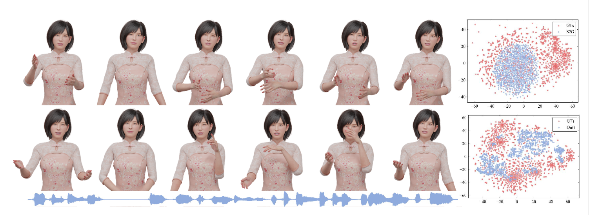

<p align="center">
  
</p>

<h1 style="text-align: center;">
DisCo: Disentangled Implicit Content and Rhythm Learning for Diverse Co-Speech Gestures Synthesis
</h1>

 
## Reproduction Based on Relased Model
### Train and test DisCo
0. `python == 3.7`
1. build folders like:
    ```
    audio2pose
    ├── codes
    │   └── audio2pose
    ├── datasets
    │   ├── trinity
    │   └── s2g
    └── outputs
        └── audio2pose
            ├── custom
            └── wandb   
    ```
2. download the framework scripts from [BEAT](https://github.com/PantoMatrix/BEAT) to `codes/audio2pose/`
3. run ```pip install -r requirements.txt``` in the path `./codes/audio2pose/`
4. download trinity dataset to `datasets/trinity`
5. bulid data cache and calculate mean and std by given `number of joints`, `FPS`, `speakers` using `/dataloader/preprocessing.ipynb`
6. put ```disco.py``` under ```./audio2pose/model/``` and customize ```disco_trainer.py``` for contrastive learning.   
7. run ```python train.py -c ./configs/disco_trinity_ae.yaml``` for pretrained_ae for FID calculation.
8. run ```python train.py -c ./configs/disco_trinity.yaml``` for training.
9. run ```python test.py -c ./configs/disco_trinity.yaml``` for inference.
10. load ```./outputs/audio2pose/custom/exp_name/epoch_number/xxx.bvh``` into blender to visualize the test results.

### From data in other dataset (e.g. S2G) 
- refer `train and test DisCo` for bvh cache
- set `dataset: trinity` in `.yaml`

## Citation
DisCo is established for the following research project.
```bib
@inproceedings{liu2022disco,
    title={DisCo: Disentangled Implicit Content and Rhythm Learning for Diverse Co-Speech Gestures Synthesis},
    author={Liu, Haiyang and Iwamoto, Naoya and Zhu, Zihao and Li, Zhengqing and Zhou, You and Bozkurt, Elif and Zheng, Bo},
    booktitle={Proceedings of the 30th ACM International Conference on Multimedia},
    pages={3764--3773},
    year={2022}
}
```